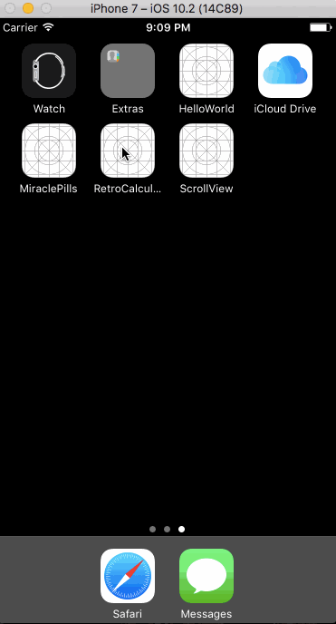

# RetroCalculator

##Description:
A retro-style calculator; written in Swift as a tutorial project for Devslopes. This app was built to learn the concepts of Auto Layout, UIStackView, custom fonts, and audio.

##Demo:

##Features/Functions Added:
- 'Clear' button functionality